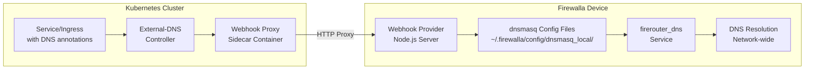

# external-dns-firewalla-webhook

A webhook provider for [external-dns](https://github.com/kubernetes-sigs/external-dns) that manages DNS records on Firewalla devices via dnsmasq configuration files.

## Overview

This project enables external-dns to automatically manage DNS records on your Firewalla device for services running in Kubernetes. It consists of two components:

1. **Webhook Provider**: A Node.js service that runs directly on your Firewalla device
2. **Webhook Proxy**: A lightweight HTTP proxy that runs as a sidecar container in your external-dns Kubernetes deployment

## Architecture



## Prerequisites

- Firewalla device (Gold, Purple, Red, or any model with SSH access)
- Firewalla firmware with Node.js at `/home/pi/firewalla/bin/node`
- Kubernetes cluster with external-dns installed
- SSH access to your Firewalla device as the `pi` user
- Sudo privileges on Firewalla

## Quick Start

### 1. Install the Webhook Provider on Firewalla

SSH into your Firewalla as the `pi` user and run:

```bash
# Set your domain filter
echo "home.local,*.home.local" > /tmp/external-dns-domain-filter

# Install the provider
curl -fsSL https://raw.githubusercontent.com/TheOutdoorProgrammer/external-dns-firewalla-webhook/main/scripts/install.sh | bash
```

### 2. Configure External-DNS

Use the Helm values from the working example in `../flux/clusters/home/external-dns/hr.yaml`:

```yaml
# Use webhook provider
provider:
  name: webhook
  webhook:
    image:
      repository: ghcr.io/theoutdoorprogrammer/external-dns-firewalla-webhook
      tag: main-89268b7
    env:
      - name: FIREWALLA_HOST
        value: "192.168.229.1"
      - name: FIREWALLA_PROVIDER_PORT
        value: "8888"
      - name: FIREWALLA_HEALTH_PORT
        value: "8080"
      - name: WEBHOOK_PORT
        value: "8888"
      - name: METRICS_PORT
        value: "8080"
    livenessProbe:
      httpGet:
        path: /health
        port: 8080
      initialDelaySeconds: 10
      timeoutSeconds: 5
    readinessProbe:
      httpGet:
        path: /ready
        port: 8080
      initialDelaySeconds: 10
      timeoutSeconds: 5

# Domain filter - must match Firewalla webhook configuration
domainFilters:
  - home.local

# Source configuration - what Kubernetes resources to watch
sources:
  - service
  - ingress

# Policy settings
policy: sync
registry: txt
txtOwnerId: home-k8s-cluster

# TXT record prefix
extraArgs:
  - --txt-prefix=external-dns-

# Logging
logLevel: info
logFormat: text

# Resources
resources:
  requests:
    cpu: 50m
    memory: 64Mi
  limits:
    cpu: 200m
    memory: 128Mi

# Single replica is sufficient for home lab
replicaCount: 1

# Service account
serviceAccount:
  create: true

# RBAC
rbac:
  create: true
```

## Configuration

### Webhook Provider (Firewalla)

Configure via `/opt/external-dns-firewalla-webhook/.env`:

```bash
DOMAIN_FILTER=home.local,*.home.local
PORT_PROVIDER=8888
PORT_HEALTH=8080
DNS_TTL=300
DNSMASQ_DIR=/home/pi/.firewalla/config/dnsmasq_local
LOG_LEVEL=info
DRY_RUN=false
RESTART_COMMAND=sudo systemctl restart firerouter_dns
```

### Webhook Proxy (Kubernetes)

Environment variables for the sidecar container:

- `FIREWALLA_HOST`: IP address of your Firewalla device
- `FIREWALLA_PROVIDER_PORT`: Provider API port on Firewalla (default: 8888)
- `FIREWALLA_HEALTH_PORT`: Health check port on Firewalla (default: 8080)
- `WEBHOOK_PORT`: Port for webhook proxy to listen on (default: 8888)
- `METRICS_PORT`: Port for health/metrics endpoints (default: 8080)

## Supported Record Types

- A records (IPv4 addresses)
- CNAME records (domain aliases)
- TXT records (for external-dns ownership tracking)

## API Endpoints

The webhook provider exposes these endpoints:

- `GET /`: Domain filter negotiation with external-dns
- `GET /records`: Retrieve current DNS records
- `POST /records`: Apply DNS record changes
- `POST /adjustendpoints`: Filter unsupported record types
- `GET /healthz`: Health check endpoint

## DNS Record Storage

DNS records are stored as individual files in `/home/pi/.firewalla/config/dnsmasq_local/`:

```
example.home.local
├── address=/example.home.local/192.168.1.100
└── address=/example.home.local/192.168.1.101

api.home.local
└── cname=api.home.local,service.home.local
```

## Testing

1. Verify the webhook provider is running on Firewalla:
   ```bash
   sudo systemctl status external-dns-firewalla-webhook
   curl http://localhost:8080/healthz
   ```

2. Check external-dns pod status:
   ```bash
   kubectl get pods -n external-dns
   kubectl logs -n external-dns -l app=external-dns
   ```

3. Create a test service with DNS annotations:
   ```yaml
   apiVersion: v1
   kind: Service
   metadata:
     name: nginx-test
     annotations:
        external-dns.alpha.kubernetes.io/hostname: nginx.home.local
   spec:
     type: LoadBalancer
     ports:
     - port: 80
     selector:
       app: nginx
   ```

## Troubleshooting

### Common Issues

1. **Service won't start on Firewalla**
   - Check logs: `sudo journalctl -u external-dns-firewalla-webhook -n 50`
   - Verify Node.js: `/home/pi/firewalla/bin/node -v`
   - Check .env file: `cat /opt/external-dns-firewalla-webhook/.env`

2. **DNS records not created**
   - Verify domain filter matches between Firewalla and external-dns
   - Check external-dns logs for connectivity issues
   - Test network connectivity from Kubernetes to Firewalla

3. **DNS service restart fails**
   - Check sudo permissions: `sudo -l | grep firerouter_dns`
   - Test manually: `sudo systemctl restart firerouter_dns`

## Development

1. Clone the repository
2. Install dependencies: `npm install`
3. Copy `.env.example` to `.env` and configure
4. Run in development mode: `npm run dev`

## License

MIT</content>
<parameter name="filePath">README.md