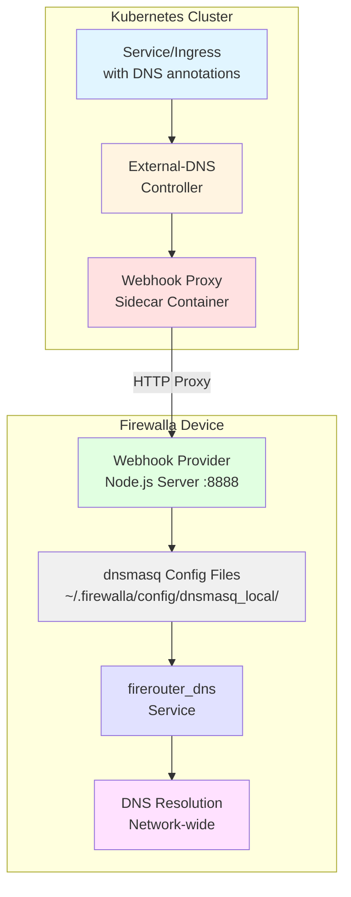

# External-DNS Firewalla Webhook Provider

A webhook provider for [external-dns](https://github.com/kubernetes-sigs/external-dns) that manages DNS records on Firewalla devices via dnsmasq configuration files.

## Overview

This webhook provider allows Kubernetes external-dns to automatically create, update, and delete DNS records on your Firewalla device. It's perfect for home labs and small deployments where you want to use your Firewalla as the authoritative DNS server for your local domains.

### Architecture



### How It Works

1. **External-DNS** running in your Kubernetes cluster detects services/ingresses that need DNS records
2. **Webhook Proxy** sidecar container (running in Kubernetes) receives requests from external-dns and forwards them to Firewalla
3. **Firewalla Webhook Provider** (running as systemd service on Firewalla) translates these requests into dnsmasq configuration files
4. **DNS records** are immediately available on your network via Firewalla's DNS server

### Deployment Model

This project consists of two components that work together:

- **Firewalla Webhook Provider** (Node.js service): Runs directly on your Firewalla device via systemd. This is the actual DNS management service that writes dnsmasq configs.
- **Webhook Proxy** (Docker container): Runs as a sidecar in your Kubernetes external-dns pod. This is a lightweight HTTP proxy that forwards requests from external-dns to the Firewalla provider.

**You need BOTH components deployed** - the provider on Firewalla, and the proxy in Kubernetes.

### Features

- ✅ Automatic DNS record management for Kubernetes resources
- ✅ Support for A records (IPv4 addresses)
- ✅ Support for TXT records (for external-dns ownership tracking)
- ✅ Multiple IP addresses per domain name
- ✅ Configurable domain filters
- ✅ Safe concurrent request handling
- ✅ Systemd service management
- ✅ Simple installation and uninstallation
- ✅ Comprehensive logging via systemd journal
- ✅ Dry-run mode for testing

## Prerequisites

- **Firewalla device** (Gold, Purple, Red, or any model with SSH access)
- **Firewalla firmware** with Node.js at `/home/pi/firewalla/bin/node` (pre-installed on most models)
- **Kubernetes cluster** with external-dns installed
- **SSH access** to your Firewalla device as the `pi` user
- **Sudo privileges** on Firewalla

## Quick Start

### Step 1: Install Webhook Provider on Firewalla

First, install the webhook provider service on your Firewalla device:

#### One-Line Installation

SSH into your Firewalla as the `pi` user and run these two commands:

```bash
# Step 1: Create config file with your domain filter
echo "home.local,*.home.local" > /tmp/external-dns-domain-filter

# Step 2: Run the installer
curl -fsSL https://raw.githubusercontent.com/TheOutdoorProgrammer/external-dns-firewalla-webhook/main/scripts/install.sh | bash
```

**Important**: Replace `home.local,*.home.local` with your actual domain filter in step 1.

**Note**: The script will prompt for your sudo password when needed for system configuration.

This will:
- Verify your domain filter configuration
- Clone the repository (with bundled dependencies)
- Verify dependencies
- Configure the service (with sudo)
- Set up your domain filter
- Start the webhook provider
- Clean up the temporary config file

**Note**: Dependencies (Express.js) are bundled in the repository since npm is not available on Firewalla.

### Manual Installation

If you prefer to review the installation script first:

1. SSH into your Firewalla device as the `pi` user:
   ```bash
   ssh pi@<firewalla-ip>
   ```

2. Clone this repository:
   ```bash
   git clone https://github.com/TheOutdoorProgrammer/external-dns-firewalla-webhook.git
   cd external-dns-firewalla-webhook
   ```

3. Review the installation script (optional):
   ```bash
   cat scripts/install.sh
   ```

4. Create the domain filter config file:
   ```bash
   echo "home.local,*.home.local" > /tmp/external-dns-domain-filter
   ```
   
   Replace `home.local,*.home.local` with your actual domains.

5. Run the installation script (as pi user, not root):
   ```bash
   ./scripts/install.sh
   ```
   
   The script will ask for your sudo password when needed.

6. Verify the service is running:
   ```bash
   sudo systemctl status external-dns-firewalla-webhook
   ```

### Step 2: Configure External-DNS in Kubernetes

After the webhook provider is running on Firewalla, configure external-dns in your Kubernetes cluster to use the webhook proxy sidecar:

#### Using Helm Chart (Recommended)

The external-dns Helm chart supports webhook providers via a sidecar container pattern. The Docker image (`ghcr.io/theoutdoorprogrammer/external-dns-firewalla-webhook`) is a lightweight HTTP proxy that forwards requests from external-dns to your Firewalla device.

Add this configuration to your `external-dns` Helm values (save as `values.yaml`):

```yaml
# Use webhook provider
provider:
  name: webhook
  webhook:
    image:
      repository: ghcr.io/theoutdoorprogrammer/external-dns-firewalla-webhook
      tag: latest  # Or use a specific version tag like 'v1.0.0' or commit SHA like 'main-abc1234'
    env:
      - name: FIREWALLA_HOST
        value: "192.168.229.1"  # Your Firewalla IP
      - name: FIREWALLA_PROVIDER_PORT
        value: "8888"
      - name: FIREWALLA_HEALTH_PORT
        value: "8080"
      - name: WEBHOOK_PORT
        value: "8888"
      - name: METRICS_PORT
        value: "8080"
    livenessProbe:
      httpGet:
        path: /health
        port: 8080
      initialDelaySeconds: 10
      timeoutSeconds: 5
    readinessProbe:
      httpGet:
        path: /ready
        port: 8080
      initialDelaySeconds: 10
      timeoutSeconds: 5

# Domain filter - must match Firewalla webhook configuration
domainFilters:
  - stout.zone

# Source configuration - what Kubernetes resources to watch
sources:
  - service
  - ingress

# Policy settings
policy: sync  # sync = manage records, upsert-only = only create/update
registry: txt  # Use TXT records to track ownership
txtOwnerId: home-k8s-cluster
txtPrefix: external-dns-

# Logging
logLevel: info
logFormat: text

# Resources
resources:
  requests:
    cpu: 50m
    memory: 64Mi
  limits:
    cpu: 200m
    memory: 128Mi

# Single replica is sufficient for home lab
replicaCount: 1

# Service account
serviceAccount:
  create: true

# RBAC
rbac:
  create: true
```

Install or upgrade external-dns:

```bash
helm repo add external-dns https://kubernetes-sigs.github.io/external-dns/
helm upgrade --install external-dns external-dns/external-dns \
  --version 1.20.0 \
  -f values.yaml \
  -n external-dns \
  --create-namespace
```

#### Using Raw Kubernetes Manifests

**Note**: The Helm chart method is strongly recommended as it properly configures the webhook sidecar container. If you must use raw manifests, here's a simplified example:

```yaml
apiVersion: apps/v1
kind: Deployment
metadata:
  name: external-dns
  namespace: external-dns
spec:
  strategy:
    type: Recreate
  selector:
    matchLabels:
      app: external-dns
  template:
    metadata:
      labels:
        app: external-dns
    spec:
      serviceAccountName: external-dns
      containers:
      - name: external-dns
        image: registry.k8s.io/external-dns/external-dns:v0.14.0
        args:
        - --source=service
        - --source=ingress
        - --domain-filter=stout.zone
        - --provider=webhook
        - --policy=sync
        - --registry=txt
        - --txt-owner-id=my-k8s-cluster
        - --txt-prefix=external-dns-
        - --log-level=info
      - name: webhook
        image: ghcr.io/theoutdoorprogrammer/external-dns-firewalla-webhook:main-f1e0b5e
        env:
        - name: FIREWALLA_HOST
          value: "192.168.229.1"
        - name: FIREWALLA_PROVIDER_PORT
          value: "8888"
        - name: FIREWALLA_HEALTH_PORT
          value: "8080"
        - name: WEBHOOK_PORT
          value: "8888"
        - name: METRICS_PORT
          value: "8080"
        ports:
        - name: http
          containerPort: 8888
          protocol: TCP
        - name: http-metrics
          containerPort: 8080
          protocol: TCP
        livenessProbe:
          httpGet:
            path: /health
            port: 8080
          initialDelaySeconds: 10
          timeoutSeconds: 5
        readinessProbe:
          httpGet:
            path: /ready
            port: 8080
          initialDelaySeconds: 10
          timeoutSeconds: 5
```

### Testing

1. **Test Webhook Provider on Firewalla**:
```bash
# SSH to Firewalla
ssh pi@<firewalla-ip>

# Check if service is running
sudo systemctl status external-dns-firewalla-webhook

# Test health endpoint directly
curl http://localhost:8080/healthz

# Test provider endpoint
curl http://localhost:8888/
```

2. **Test Webhook Proxy in Kubernetes**:
```bash
# Check if external-dns pod is running
kubectl get pods -n external-dns

# Test webhook proxy health from within the cluster
kubectl exec -n external-dns -it deployment/external-dns -- curl http://localhost:8080/health

# Check external-dns logs for webhook communication
kubectl logs -n external-dns -l app=external-dns
```

3. **Create a test service in Kubernetes**:

```yaml
apiVersion: v1
kind: Service
metadata:
  name: nginx-test
  annotations:
    external-dns.alpha.kubernetes.io/hostname: nginx.stout.zone
spec:
  type: LoadBalancer
  ports:
  - port: 80
    targetPort: 80
  selector:
    app: nginx
```

4. **Apply the service**:
```bash
kubectl apply -f test-service.yaml
```

5. **Monitor the process**:
```bash
# Watch external-dns logs in real-time
kubectl logs -n external-dns -l app=external-dns -f

# Watch webhook provider logs on Firewalla
ssh pi@<firewalla-ip> "sudo journalctl -u external-dns-firewalla-webhook -f"
```

6. **Verify DNS record was created on Firewalla**:
```bash
# SSH to Firewalla
ssh pi@<firewalla-ip>

# Check the DNS record file
cat ~/.firewalla/config/dnsmasq_local/nginx.stout.zone

# Test DNS resolution
dig @localhost nginx.stout.zone
```

7. **Test from another device on your network**:
```bash
# From any device on your network
nslookup nginx.stout.zone <firewalla-ip>
```

## Configuration

### Environment Variables

#### Firewalla Webhook Provider (Systemd Service)

The webhook provider is configured via the `.env` file located at `/opt/external-dns-firewalla-webhook/.env`.

**Required Variables:**

- `DOMAIN_FILTER`: Comma-separated list of domains to manage (e.g., `stout.zone,*.stout.zone`)

**Optional Variables:**

- `PORT_PROVIDER`: Provider API port (default: `8888`)
- `PORT_HEALTH`: Health check port (default: `8080`)
- `DNS_TTL`: Default TTL for DNS records in seconds (default: `300`)
- `DNSMASQ_DIR`: Path to dnsmasq config directory (default: `/home/pi/.firewalla/config/dnsmasq_local`)
- `LOG_LEVEL`: Log level - `error`, `warn`, `info`, or `debug` (default: `info`)
- `DRY_RUN`: If `true`, don't make actual changes (default: `false`)

#### Webhook Proxy (Kubernetes Sidecar)

The webhook proxy container uses these environment variables (configured in Helm values or Kubernetes manifests):

- `FIREWALLA_HOST`: IP address of your Firewalla device (default: `192.168.229.1`)
- `FIREWALLA_PROVIDER_PORT`: Provider API port on Firewalla (default: `8888`)
- `FIREWALLA_HEALTH_PORT`: Health check port on Firewalla (default: `8080`)
- `WEBHOOK_PORT`: Port for webhook proxy to listen on (default: `8888`)
- `METRICS_PORT`: Port for health/metrics endpoints (default: `8080`)

### Editing Configuration

1. Edit the .env file:
   ```bash
   sudo nano /opt/external-dns-firewalla-webhook/.env
   ```

2. Restart the service:
   ```bash
   sudo systemctl restart external-dns-firewalla-webhook
   ```

## Management

### Viewing Logs

```bash
# Follow live logs
sudo journalctl -u external-dns-firewalla-webhook -f

# View recent logs
sudo journalctl -u external-dns-firewalla-webhook -n 100

# View logs with timestamps
sudo journalctl -u external-dns-firewalla-webhook -e --no-pager
```

### Service Management

```bash
# Check service status
sudo systemctl status external-dns-firewalla-webhook

# Start service
sudo systemctl start external-dns-firewalla-webhook

# Stop service
sudo systemctl stop external-dns-firewalla-webhook

# Restart service
sudo systemctl restart external-dns-firewalla-webhook

# Enable service (start on boot)
sudo systemctl enable external-dns-firewalla-webhook

# Disable service
sudo systemctl disable external-dns-firewalla-webhook
```

### Viewing DNS Records

All DNS records managed by this webhook are stored as files in `/home/pi/.firewalla/config/dnsmasq_local/`:

```bash
# List all DNS records
ls -la ~/.firewalla/config/dnsmasq_local/

# View a specific record
cat ~/.firewalla/config/dnsmasq_local/nginx.home.local

# Count total records
ls ~/.firewalla/config/dnsmasq_local/ | wc -l
```

## Uninstallation

### One-Line Uninstall (Preserves DNS Records)

SSH into your Firewalla as the `pi` user and run:

```bash
curl -fsSL https://raw.githubusercontent.com/TheOutdoorProgrammer/external-dns-firewalla-webhook/main/scripts/uninstall.sh | bash
```

**Note**: The script will prompt for your sudo password when needed.

This removes the service but **keeps** your DNS records in case you want to reinstall later.

### One-Line Complete Removal (Deletes All DNS Records)

⚠️ **WARNING**: This will delete all DNS records managed by this webhook!

```bash
curl -fsSL https://raw.githubusercontent.com/TheOutdoorProgrammer/external-dns-firewalla-webhook/main/scripts/uninstall.sh | bash -s -- --purge
```

### Manual Uninstall

If the webhook is already installed locally, run as the `pi` user (not root):

**Standard uninstall (preserves DNS records):**
```bash
cd /opt/external-dns-firewalla-webhook
./scripts/uninstall.sh
```

**Complete removal (deletes DNS records):**
```bash
cd /opt/external-dns-firewalla-webhook
./scripts/uninstall.sh --purge
```

The script will ask for your sudo password when needed.

## Architecture

### Components

1. **Express.js Server**: Implements the external-dns webhook protocol
   - Provider API (port 8888): Handles DNS record operations
   - Health API (port 8080): Kubernetes health checks

2. **Dnsmasq Service**: Manages DNS record files
   - Creates/updates/deletes files in `~/.firewalla/config/dnsmasq_local/`
   - Restarts `firerouter_dns` service to apply changes

3. **Systemd Service**: Ensures the webhook provider runs continuously
   - Auto-restart on failure
   - Starts on system boot
   - Logs to systemd journal

### API Endpoints

| Endpoint | Method | Purpose |
|----------|--------|---------|
| `/` | GET | Negotiate domain filters with external-dns |
| `/records` | GET | Retrieve current DNS records |
| `/records` | POST | Apply DNS record changes (create/update/delete) |
| `/adjustendpoints` | POST | Filter unsupported record types |
| `/healthz` | GET | Health check for Kubernetes probes |

### DNS Record Format

#### A Records
File: `~/.firewalla/config/dnsmasq_local/example.home.local`
```
address=/example.home.local/192.168.1.100
address=/example.home.local/192.168.1.101
```

#### TXT Records  
File: `~/.firewalla/config/dnsmasq_local/external-dns-a-example.home.local.txt`
```
txt-record=external-dns-a-example.home.local,"heritage=external-dns,external-dns/owner=my-cluster"
```

## Troubleshooting

### Service Won't Start

1. Check the logs:
   ```bash
   sudo journalctl -u external-dns-firewalla-webhook -n 50
   ```

2. Verify Node.js is installed at the Firewalla path:
   ```bash
   /home/pi/firewalla/bin/node -v  # Should be 12.14.0 or higher
   ```

3. Check the .env file:
   ```bash
   cat /opt/external-dns-firewalla-webhook/.env
   ```

4. Ensure DOMAIN_FILTER is set:
   ```bash
   grep DOMAIN_FILTER /opt/external-dns-firewalla-webhook/.env
   ```

### DNS Records Not Created

1. **Check external-dns logs in Kubernetes**:
    ```bash
    kubectl logs -n external-dns -l app=external-dns --tail=100
    ```

2. **Verify webhook proxy is running**:
    ```bash
    # Check if webhook container is healthy
    kubectl get pods -n external-dns
    kubectl describe pod -n external-dns <external-dns-pod-name>
    ```

3. **Test webhook proxy connectivity**:
    ```bash
    # Test from within the external-dns pod
    kubectl exec -n external-dns -it deployment/external-dns -c webhook -- curl http://localhost:8080/health

    # Test connectivity to Firewalla from the pod
    kubectl exec -n external-dns -it deployment/external-dns -c webhook -- curl http://<firewalla-ip>:8080/healthz
    ```

4. **Check webhook provider logs on Firewalla**:
    ```bash
    sudo journalctl -u external-dns-firewalla-webhook -f
    ```

5. **Verify domain filter matches**:
    - Firewalla `.env`: `DOMAIN_FILTER=stout.zone`
    - External-DNS: `--domain-filter=stout.zone` or `domainFilters: [stout.zone]`

6. **Check network connectivity**:
    ```bash
    # From external-dns pod, test Firewalla reachability
    kubectl exec -n external-dns -it deployment/external-dns -c webhook -- ping -c 3 <firewalla-ip>
    ```

### DNS Service Restart Fails

1. Check if you have sudo permissions:
   ```bash
   sudo -l | grep firerouter_dns
   ```

2. Manually test the restart command:
   ```bash
   sudo systemctl restart firerouter_dns
   ```

3. Verify the sudoers file:
   ```bash
   cat /etc/sudoers.d/external-dns-webhook
   ```

### Webhook Proxy Health Check Issues

If the webhook proxy sidecar shows unhealthy readiness/liveness probes:

1. **Check proxy logs**:
    ```bash
    kubectl logs -n external-dns -c webhook <external-dns-pod-name>
    ```

2. **Verify Firewalla connectivity from proxy**:
    ```bash
    kubectl exec -n external-dns -c webhook <external-dns-pod-name> -- curl -v http://<firewalla-ip>:8080/healthz
    ```

3. **Check environment variables**:
    ```bash
    kubectl exec -n external-dns -c webhook <external-dns-pod-name> -- env | grep -E "(FIREWALLA|WEBHOOK|METRICS)"
    ```

### Port Already in Use

If ports 8888 or 8080 are already in use on Firewalla:

1. Edit the .env file:
   ```bash
   sudo nano /opt/external-dns-firewalla-webhook/.env
   ```

2. Change `PORT_PROVIDER` or `PORT_HEALTH` to different values

3. Restart the service:
   ```bash
   sudo systemctl restart external-dns-firewalla-webhook
   ```

4. Update your external-dns configuration to use the new port

## Security Considerations

1. **Network Access**: The webhook provider binds to `0.0.0.0`, making it accessible from your entire network. Ensure your Firewalla firewall rules restrict access to only your Kubernetes cluster.

2. **Sudo Permissions**: The service requires sudo access to restart `firerouter_dns`. This is limited to only that specific command via sudoers configuration.

3. **Input Validation**: All DNS names and IP addresses are validated before being written to files to prevent path traversal and injection attacks.

4. **File Permissions**: DNS record files are created with 644 permissions (readable by all, writable by owner).

## Advanced Usage

### Dry Run Mode

Test the webhook without making actual changes:

1. Enable dry run:
   ```bash
   sudo nano /opt/external-dns-firewalla-webhook/.env
   # Set: DRY_RUN=true
   ```

2. Restart the service:
   ```bash
   sudo systemctl restart external-dns-firewalla-webhook
   ```

3. Watch the logs to see what would be changed:
   ```bash
   sudo journalctl -u external-dns-firewalla-webhook -f
   ```

### Multiple Domains

Configure multiple domain filters:

```bash
DOMAIN_FILTER=home.local,*.home.local,lab.local,*.lab.local
```

### Debug Logging

Enable detailed debug logging:

```bash
# Edit .env
sudo nano /opt/external-dns-firewalla-webhook/.env
# Set: LOG_LEVEL=debug

# Restart service
sudo systemctl restart external-dns-firewalla-webhook

# Watch debug logs
sudo journalctl -u external-dns-firewalla-webhook -f
```

## Contributing

Contributions are welcome! Please feel free to submit a Pull Request.

### Development Setup

1. Clone the repository:
   ```bash
   git clone https://github.com/TheOutdoorProgrammer/external-dns-firewalla-webhook.git
   cd external-dns-firewalla-webhook
   ```

2. Install dependencies:
   ```bash
   npm install
   ```

3. Create a .env file:
   ```bash
   cp .env.example .env
   # Edit .env with your configuration
   ```

4. Run in development mode:
   ```bash
   npm run dev
   ```

## License

This project is licensed under the MIT License - see the [LICENSE](LICENSE) file for details.

## Acknowledgments

- [external-dns](https://github.com/kubernetes-sigs/external-dns) - Kubernetes external-dns project
- [Firewalla](https://firewalla.com/) - Smart firewall and router platform
- The Kubernetes community

## Support

- **Issues**: [GitHub Issues](https://github.com/TheOutdoorProgrammer/external-dns-firewalla-webhook/issues)
- **Discussions**: [GitHub Discussions](https://github.com/TheOutdoorProgrammer/external-dns-firewalla-webhook/discussions)

## Changelog

### v1.0.0 (Initial Release)

- External-DNS webhook provider implementation
- Support for A and TXT records
- Multiple IP addresses per domain
- Systemd service management
- Installation and uninstallation scripts
- Comprehensive logging
- Dry-run mode
- Concurrent request handling
